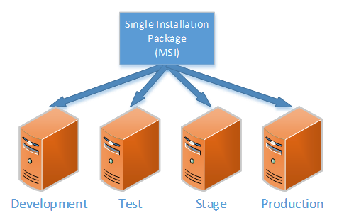
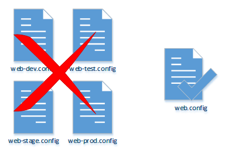
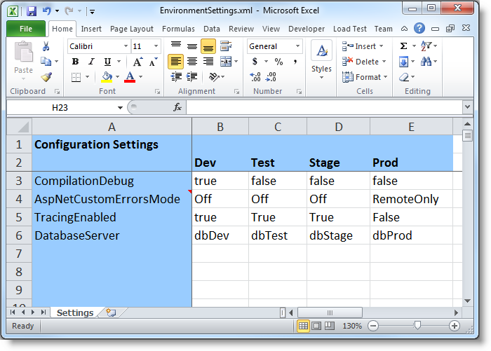
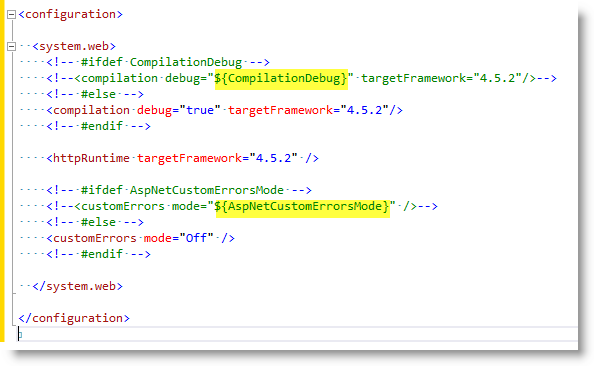
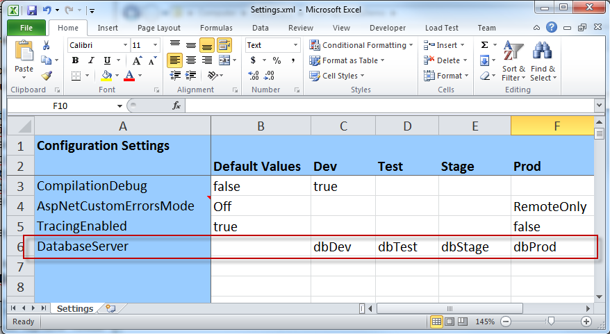
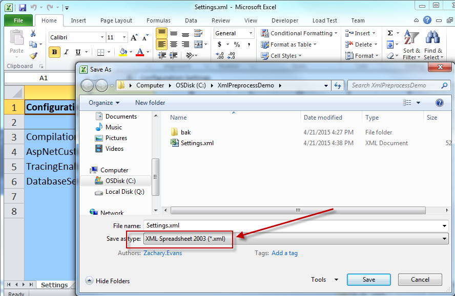

# XmlPreprocess

XmlPreprocess is a command-line utility used at deployment time to inject settings into configuration files that need to change from environment to environment. A typical example is a database connection string in web.config that needs to point to a different database in a **Development** environment than it does in **Test**, **Stage** and **Production**. The preprocessing step can be incorporated into a variety of deployment strategies including a Windows installer package as a Custom Action so that it silently runs whenever the package is installed.

> _Note: XmlPreprocess 3 has been relocated to GitHub from [Codeplex](http://xmlpreprocess.codeplex.com) where version 2 can still be found. XmlPreprocess 3 requires .NET runtime version 4.5 or higher on the destination machine, however it can preprocess configuration files for applications written in any language or framework including Java. It supports both XML and non-XML files._

Let's consider the motivations for using this technique, best practices for using it effectively, and give instructions to add it to your projects.

## Goals

Deployment-time injection of environment-specific settings achieves the following goals:

### Single installation package is deployable to any environment.



There is no need to create a development installer, a test installer etc., each with its own settings embedded in it.

Because the same build advances through all of the environments, it guarantees that the version deployed to production is the same version that was tested, reducing the risk of regression.

### A single copy of all configuration files should be maintained.



It is undesirable and even somewhat risky to maintain multiple parallel copies of the same configuration files or transforms (ex: Web.Debug.config).  Multiple copies increases the risk of developers failing to keep all of them in sync. Settings may get added to the developer copy, and either not added to the other copies, or added incorrectly.  Those omissions or errors will not be detected until deployment to another environment when it will be harder to fix.  It would be preferable if the configuration files the developers use during daily development work is the same exact file that gets deployed to all environments.

### Configuration should be development-ready right out of source control

_get-and-go_

Ideally the configuration files checked in to source control should contain settings that are appropriate for a developer to immediately begin debugging the code without first needing to make any manual changes. This improves productivity, improves consistency among the teammates as everyone is running with the same settings, and reduces "it works on my machine" syndrome.

### Management of settings should be done in a single, centralized place.

The management of settings should ideally be consolidated in a single place, preferably with an easy-to-use interface instead of distributed among dozens of XML files scattered all around source control.

* This encourages consistent use of settings across multiple applications and configuration files. For example, all applications can set their compilation debug setting using a single setting. You don't have to know all of the places it is used in order to change all of them.
* Changes can be done by anyone on the team even non-technical team members, no need to edit XML directly.
	
Here is how it can be thought of conceptually, a spreadsheet with settings down the left, and environments across the top.  The cells contain the values to use for that setting in each environment.



_Note: This is conceptual, the actual spreadsheet has a slightly different format as you will see._

So in this example when I deploy to **Dev** it should be:
```xml
<compilation debug="true" targetFramework="4.5.2"/>
```

But when I deploy to Test, Stage or Prod it should be:
```xml
<compilation debug="false" targetFramework="4.5.2"/>
```

## Using XmlPreprocess

An approach that satisfies these goals is to use the open-source XmlPreprocess tool.  We decorate the XML configuration files with preprocessing markup (similar to the way a code preprocessor works).  The XML comments are invisible to the configuration system, so everything continues to work during development. The XmlPreprocessor however can see the markup and uses it to write out a new version of the file with substitutions made.

Simplified web.config example:



The preprocessor only needs three things:
1. The file (or files) you want to preprocess (**/input** argument)
2. The spreadsheet containing the settings to use for each environment (**/spreadsheet** argument)
3. The name of the spreadsheet column from which you want to draw your settings (**/environment** argument)

The following command will transform the above web.config, replacing the placeholders with the values from the **Dev** column of the spreadsheet.
```
XmlPreprocess /input:web.config /spreadsheet:Settings.xml /environment:Dev
```

The transformed Web.config would look like this:
```xml
<configuration>
  <system.web>
    <compilation debug="true" targetFramework="4.5.2"/>
    <httpRuntime targetFramework="4.5.2" />
    <customErrors mode="Off" />
  </system.web>
</configuration>
```

The following command will transform web.config, replacing the placeholders with the values from the **Prod** column of the spreadsheet.
```
XmlPreprocess /input:*.config /spreadsheet:Settings.xml /environment:Prod
```

The transformed Web.config would look like this:
```xml
<configuration>
  <system.web>
    <compilation debug="false" targetFramework="4.5.2"/>
    <httpRuntime targetFramework="4.5.2" />
    <customErrors mode="RemoteOnly" />
  </system.web>
</configuration>
```

## Adding New Settings

Imagine your configuration file starts out looking like this. The development database server **dbDev** needing to be substituted with a different server in each environment.
```xml
<configuration>
  <connectionStrings>
    <add name="MyData"
         connectionString="Data Source=dbDev;Initial Catalog=MyDb"
         providerName="System.Data.SqlClient"/>
  </connectionStrings>
</configuration>
```

### Steps

1. Add the setting to the spreadsheet with the appropriate values for each environment.  In this example we added the row DatabaseServer.



2. Surround the configuration with preprocessor markup.
  
Add #ifdef/#else/#endif comments around your original configuration.
```xml
<configuration>
  <!-- #ifdef _xml_preprocess -->
  <!-- <your original configuration.../> -->
  <!-- #else -->
  <your original configuration.../>
  <!-- #endif -->
</configuration>
```
Insert placeholder tokens into the commented out #ifdef branch that match settings in your spreadsheet. Here is what it would look like completed:
```xml
<configuration>
  <connectionStrings>
    <!-- #ifdef _xml_preprocess -->
    <!--
    <add name="MyData" providerName="System.Data.SqlClient"
         connectionString="Data Source=${DatabaseServer};Initial Catalog=MyDb"/>
    -->
    <!-- #else -->
    <add name="MyData" providerName="System.Data.SqlClient"
         connectionString="Data Source=dbDev;Initial Catalog=MyDb"/>
    <!-- #endif -->
  </connectionStrings>
</configuration>
```

> _Tip: Multiple settings can be combined in one #ifdef_

```xml
<configuration>
  <appSettings>
    <!-- #ifdef _xml_preprocess -->
    <!--
    <add key="username" value="${Username}" />
    <add key="password" value="${Password}" />
    <add key="format" value="${Format}" />
    <add key="secret_token" value="${SecretToken}" />
    <add key="SFRestURL" value="https://${SomeDomain}/services/" />
    -->
    <!-- #else -->
    <add key="username" value="xxx@foo.com" />
    <add key="password" value="xxx@xxx" />
    <add key="format" value="json" />
    <add key="secret_token" value="12345678" />
    <add key="SFRestURL" value="https://somedomain.com/services/" />
    <!-- #endif -->
  </appSettings>
</configuration>
```

### XmlPreprocess Built In Settings

Any XmlPreprocess placeholder that begins with an underscore (ex: ${\_dest\_dir} ) is a "built-in" property. They should never be added to the environment Excel spreadsheet because they are dynamically expanded at deployment time by environmental values that are only known on the machine at that instant.

For example \_dest\_dir can be used to allow the package to be deployed to any location. _dest_dir gets substituted with the directory in which the config file is sitting, it gives the package location independence. One useful scenario is to enable developers to install an MSI locally even if the server destination is typically on the D: drive, and they only have a C: drive. 

For example if the original web.config file has the following placeholder
```xml
<add name="External File" type="Microsoft.Practices..." filePath="${_dest_dir}\entlibglobal.config" />
```

When the app is deployed to: D:\Inetpub\wwwroot\MyWeb

The config file will contain:
```xml
<add name="External File" type="Microsoft.Practices..." filePath="D:\Inetpub\wwwroot\MyWeb\entlibglobal.config" />
```

If it is deployed to: C:\Inetpub\websites\YourWeb

The config file will contain:
```xml
<add name="External File" type="Microsoft.Practices..." filePath="C:\Inetpub\websites\YourWeb\entlibglobal.config" />
```

It's always a good idea to remove hard-coded assumptions about where things are installed for testing or side-by-side installations.

Here is a complete list of the built-in properties

|Property Name         |Description   |
|----------------------|--------------|
| \_xml\_preprocess    | This property will always be defined whenever a file is being processed by the Xml Preprocessor |
| \_dest\_dir          | Directory portion of destination file. Example: d:\inetpub\wwwroot\web |
| \_dest\_root         | Root part of \_dest\_dir. Example: d:\ |
| \_machine\_name      | Name of machine. Example: vmspap02caa |
| \_machine\_id        | Numeric portion of machine name. Example: 02 |
| \_os\_platform       | Machine OS platform. Example: Win32NT |
| \_os\_version        | Machine OS version. Example: 5.1.2600.0 |
| \_system\_dir        | Machine's system directory. Example: C:\WINNT\System32 |
| \_system\_root       | Root part of \_system\_dir. Example: C:\ |
| \_current\_dir       | Machine's current directory. Example: "C:\Installs |
| \_current\_root      | Root part of \_current\_dir. Example: C:\ |
| \_clr\_version       | Gets the major, minor, build, and revision numbers of the common language runtime. Example: 1.1.4322 |
| \_user\_name         | Gets the user name of the person who started the current thread. Example: EFudd |
| \_user\_domain_name  | Gets the network domain name associated with the current user. Example: MyDomain |
| \_user\_interactive  | Gets a value indicating whether the current process is running in user interactive mode. Example: True |
| \_system\_date       | System date. Example: 8/5/2003 |
| \_system\_time       | System time. Example: 9:50 AM |
| \_framework\_dir     | .NET Framework directory. Example: C:\WINNT\Microsoft.NET\Framework\v1.1.4322 |
| \_environment\_name  | Value passed in to the /e argument if there was one |
| \_env\_*             | Environment variables. Example: \_ENV\_PATH contains system's path environment variable. |

## Incorporating into Build

The Spreadsheet should be added to your source control, and included in your distribution package along with XmlPreprocess.exe.

### Spreadsheet Guidance

* **Keep the number of spreadsheets low.**
  * Eases the management of spreadsheets.
  * Reduces the duplication of settings that cross multiple packages.
  * Spreadsheets should to correspond units of code that tend to ship together on similar timing or correspond to team organization.
* **Be descriptive in your setting names** - Make it evident from a setting name what it does. Especially use care in choosing names in spreadsheets  that are shared among multiple projects.  Perhaps prefix the application name on settings unique to your application.
* **Use Excel Formatting** - Feel free to use Excel formatting to make the settings easier to manager. For example cell comments, color, blank rows as separators, row headings  to group related settings together.
* **Save spreadsheet in "XML Spreadsheet 2003" format** - This saves them in a text format (instead of binary) and makes it easier to see differences between versions in source control.



## Integrating into WiX Installer as Custom Action

Add the following files to your installation package:
* **XmlPreprocess.exe** - The preprocessor command line utility
* **EnvironmentSettings.xml** - The environment settings spreadsheet (Note: filename can be different)
* **config.bat** - By convention a batch file is included to actually run the preprocessing step, the custom action runs this batch file passing in the ENVIRONMENT argument.  This is not necessary if you wish to put the full command directly into the Custom action. But having a separate batch file makes it easier to test or reconfigure independently of running the installer.

Tip: You may want to isolate the above 3 files into their own /config subdirectory and adjust paths accordingly to avoid cluttering up the root folder of your application

**--Example config.bat--**
```
pushd %~dp0
XmlPreprocess.exe /nologo /v /spreadsheet:EnvironmentSettings.xml /input:*.config /environment:"%~1"
```

**-- Sample Product.wxs--**
```xml
<Wix...>
  <Product...>

    <CustomAction Id="ConfigureApp_Cmd" Property="ConfigureApp" Execute="immediate"
      Value="&quot;[INSTALLDIR]config.bat&quot; &quot;[ENVIRONMENT]&quot;" />

    <CustomAction Id="ConfigureApp" BinaryKey="WixCA" DllEntry="CAQuietExec"
      Execute="deferred" Return="check" Impersonate="no"/>

    <InstallExecuteSequence>

      <Custom Action="ConfigureApp_Cmd" After="MsiConfigureServices">
        <![CDATA[((REINSTALL OR NOT Installed)
          OR (Installed AND ProductState=5 AND NOT REMOVE))
          AND (ENVIRONMENT <> "") AND (ENVIRONMENT <> "(none)")]]>
      </Custom>

      <Custom Action="ConfigureApp" After="ConfigureApp_Cmd">
        <![CDATA[((REINSTALL OR NOT Installed)
          OR (Installed AND ProductState=5 AND NOT REMOVE))
          AND (ENVIRONMENT <> "") AND (ENVIRONMENT <> "(none)")]]>
      </Custom>

    </InstallExecuteSequence>

  </Product>
</Wix>
```

## Installation

When you install your MSI, you simply need to pass one additional argument
```
MyProduct.msi ENVIRONMENT=Dev
```
